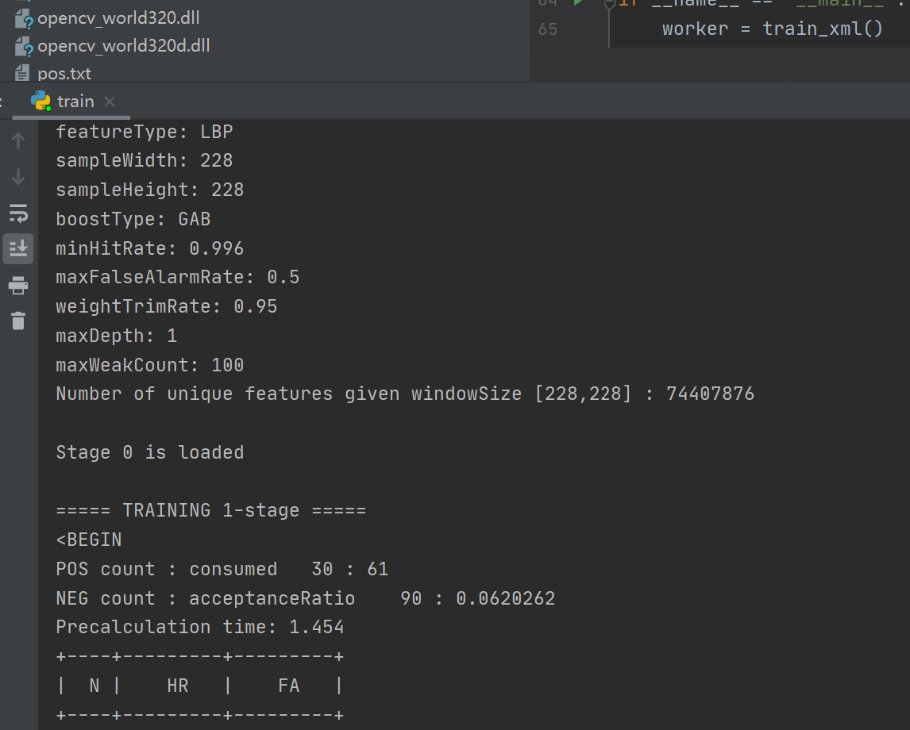
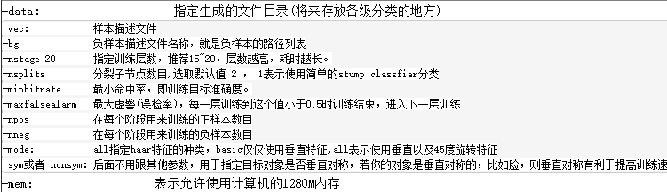
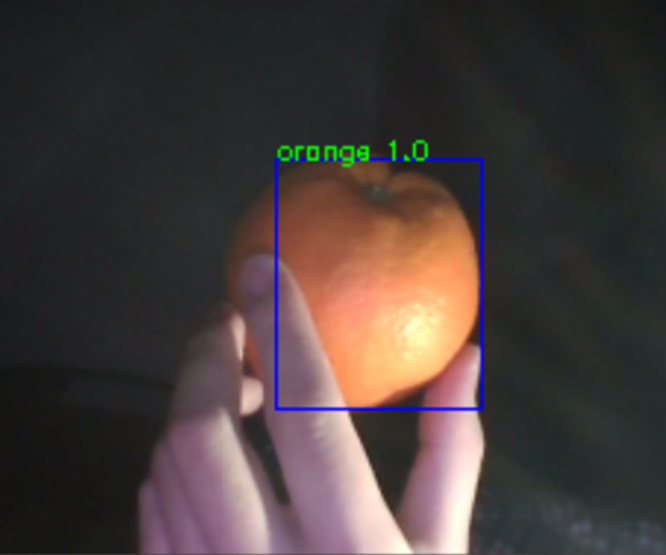

# iOCO-Cascade_Classifier
This is a script that helps complete the parameter configuration and training of OpenCV cascade classifiers with once click, simplifying program invocation and configuration.

## Quick start
1. Place the OpenCV cascading trainer files in the directory `opencv_ toolkit`
2. Place positive and negative samples in the `dataset/pos` and `dataset/neg` folders
3. Modify the parameters in the `options.py`
4. Run the `train.py`
5. Check the result by `inference.py`

## Some other statements
- Some parameters are explained as follows:

- An example of the detection results:

## More instructions
For more information please visit the blog: <http://t.csdn.cn/y3d7l>
